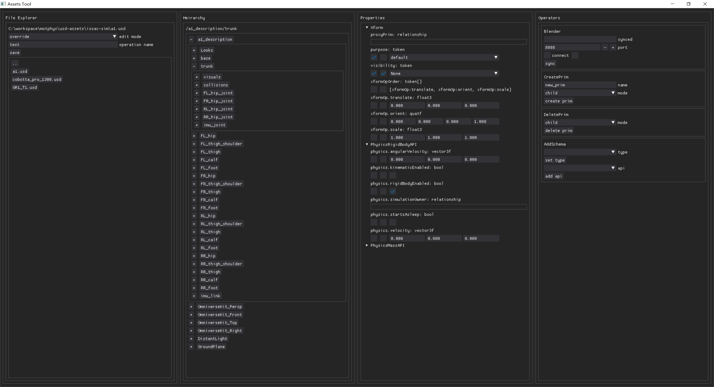
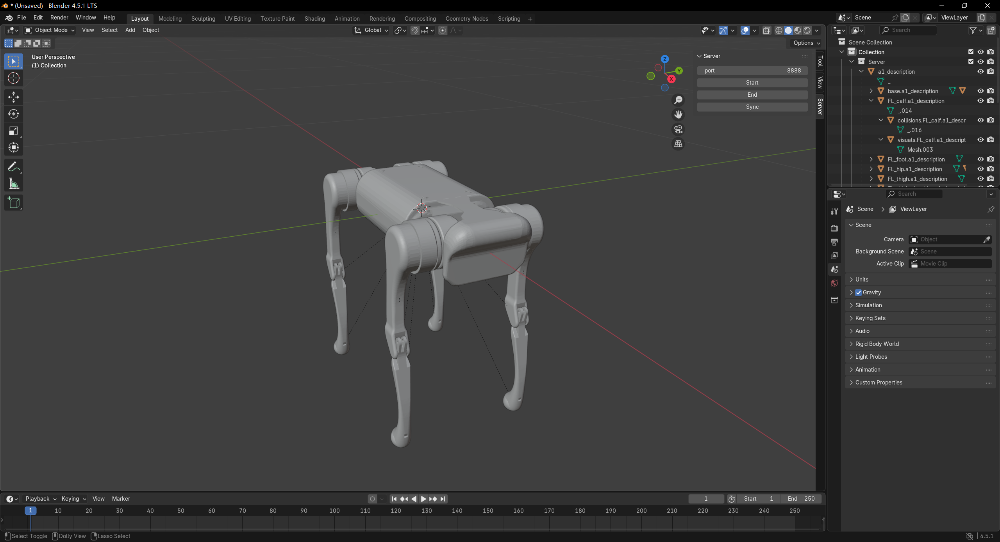

# Assets Tool

## Add to your python project

1. use your python package manager install this package via git.
2. ```python
    from assets_tool import App
    app = App()
    app.run()
   ```

## Usage



### File Explorer

explore the file system and handle file IO.

- text in first line: currently opened file's path.
- `edit mode` selector:
  - `modify`: directly modify current file.
  - `override`: create a new file to reference the opened file and override some of it.
  - `override replace`: beyond `override`, name the new file the original name, so reference to the original file will point to the new file.
- `operation name` input text: only show up when `edit mode` is `override` or `override replace`, name your operation did on the opened file, which will be used to name the files.
- `save` button: save your operation into files.
- folder window: click to open a file or go into a folder, click `..` to go back to parent folder.

### Hierarchy

explore USD prim hierarchy and select prim.

- text in first line: currently selected prim's path.
- hierarchy window: usd prim hierarchy, click to select a prim, click `+` to open a folded prim branch.

### Properties

explore prim's schema, edit selected prim's properties.

each foledable container represents a schema, the first one is the typed schema, lefts are api schemas. each schema contains it properties.

for each property:

- first checkbox from left: if the editing file has opinion on this property, check it to edit the value, uncheck to remove opinion on this value.
- second checkbox from left: if block the value, check to set to default value, uncheck to edit the value.
- value editor: only editable when first checkbox checked and second unchecked, otherwise display the composed value.

### Operators

operation you can do to modify the editing file.

each subwindow represents an operation.

#### Blender Client

enable sync a branch of usd hierarchy to `blender` to edit.

clone [`software-server`](https://github.com/UnamedStudio/software-server), `/blender_server` in it is a blender addon, use symbolic link to place it to your blender addon search directory or pack it to a zip and install that inside blender GUI.



open the addon pannel `server`,

- `port` input text: the port used to set up a server.
- `start` button: start the server.
- `end` button: end the server.
- `sync` button: sync your operation in blender back to its connector, in this situation, `assets tool`.

on `assets tool` side:

- `synced` text: currently synced prim's path.
- `port` input text: the port used to connect the server.
- `connect` checkbox: check left checkbox to connect to server, uncheck to disconnect. the right check box shows if the server is connected.
- `sync` button: sync the USD branch rooted at the selected prim to server.

#### Create Prim

- `name` input text: the name of the new prim.
- `mode`:
  - `child`: place the new prim as selected prim's child.
  - `brother`: place the new prim as selected prim's brother.
- `create prim` button: create a new prim.

#### Delete Prim

- `delete prim` button: delete the selected prim.

#### Add Schema

- `type` selector: select a typed schema to use.
- `set type` button: set the selected prim's type to `type`.
- `api` selector: select a api schema to use.
- `instance name`: only show up when `api` is a multi-apply api, set the instance name of it.
- `apply api` button: apply `api` to the selected prim.
